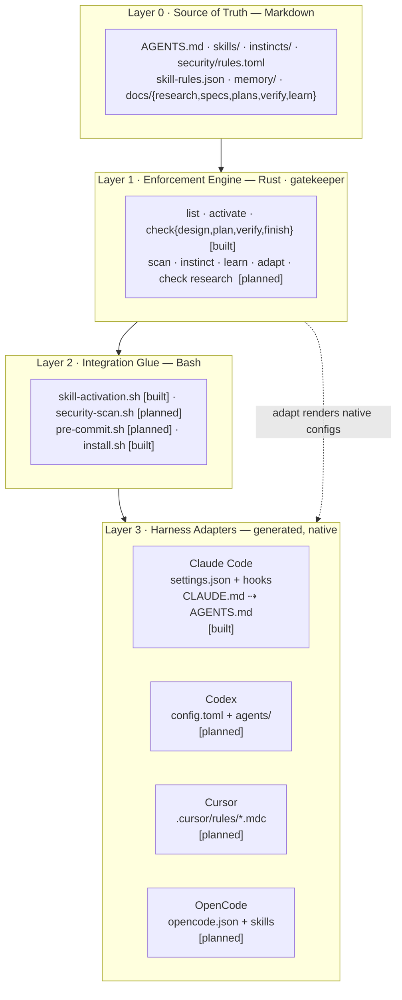
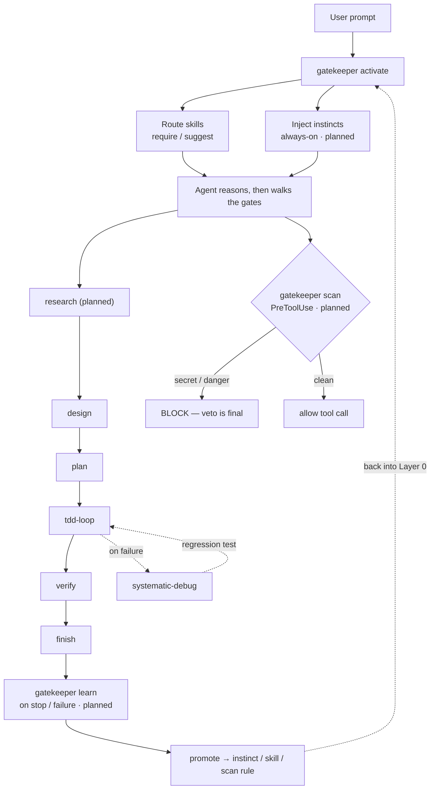
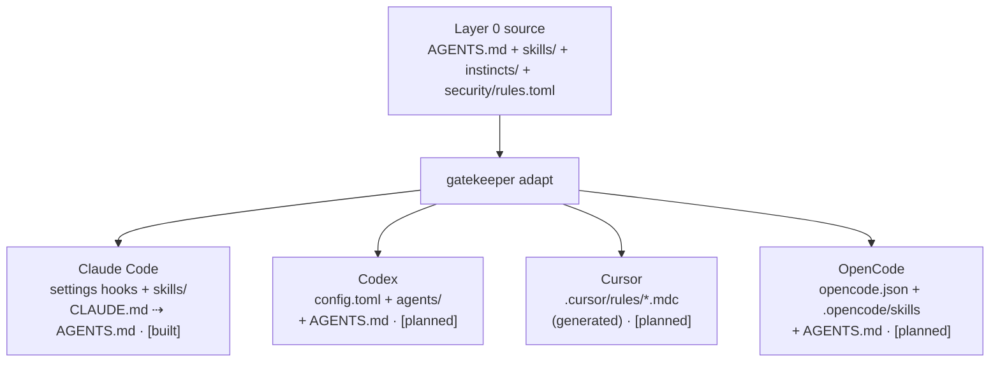

# Architecture

How the Topology operator system is put together. For *what* it is and *why*, read
[`../METHODOLOGY.md`](../METHODOLOGY.md); for the build order, [`ROADMAP.md`](ROADMAP.md).

Every component is tagged `[built]` (ships today) or `[planned]` (designed, on the roadmap).

**The three-language rule.** Markdown is the source of truth (portable, human/agent-editable). Rust
is the deterministic enforcer (`gatekeeper`: one fast, dependency-free binary). Bash is the thin glue
(hooks and installers every harness can shell out to). Nothing crosses those lanes.

---

## 1. The layered model



ASCII fallback:

```
┌──────────────────────────────────────────────────────────────────────┐
│ LAYER 3 · HARNESS ADAPTERS   (generated, harness-native)              │
│ Claude Code [built]  Codex [plan]  Cursor [plan]   OpenCode [plan]     │
│ settings+hooks       config.toml   .cursor/rules/  opencode.json       │
│ CLAUDE.md⇢AGENTS     +agents/      *.mdc           +.opencode/skills   │
└───────────▲───────────────▲───────────────▲───────────────▲──────────┘
            │        gatekeeper adapt  (renders native configs from L0)
┌───────────┴──────────────────────────────────────────────────────────┐
│ LAYER 2 · INTEGRATION GLUE   (Bash · set -euo pipefail)               │
│ skill-activation.sh [built]  security-scan.sh [plan]                   │
│ pre-commit.sh [plan]         install.sh [built]                        │
└───────────▲──────────────────────────────────────────────────────────┘
            │   invoked by each harness's hook/lifecycle events
┌───────────┴──────────────────────────────────────────────────────────┐
│ LAYER 1 · ENFORCEMENT ENGINE   (Rust · gatekeeper, std-only, tested)  │
│ list · activate · check{design,plan,verify,finish}        [built]     │
│ scan · instinct · learn · adapt · check{research}         [planned]   │
└───────────▲──────────────────────────────────────────────────────────┘
            │   reads
┌───────────┴──────────────────────────────────────────────────────────┐
│ LAYER 0 · SOURCE OF TRUTH   (Markdown — one source, all harnesses)    │
│ AGENTS.md  skills/  instincts/  security/rules.toml                    │
│ skill-rules.json  memory/  docs/{research,specs,plans,verify,learn}    │
└───────────────────────────────────────────────────────────────────────┘
```

### Layer detail

- **L0 — Source of truth (Markdown).** The only layer humans and agents edit directly. `AGENTS.md`
  is the bootstrap; `skills/` holds `SKILL.md` units; `instincts/` holds always-on nudges `[planned]`;
  `security/rules.toml` holds scan rules `[planned]`; `skill-rules.json` is the keyword routing table;
  `memory/` holds handoff/compaction artifacts `[planned]`; `docs/` holds the per-feature gate trail.
- **L1 — Enforcement engine (Rust).** `gatekeeper` reads L0 and answers questions deterministically:
  which skills route in, does a gate pass, is this command/diff safe. Std-only so it builds offline
  and ships as one static binary. See the [contract](#4-the-gatekeeper-contract).
- **L2 — Integration glue (Bash).** Small scripts wired into each harness's lifecycle that call
  `gatekeeper` and relay its verdict. `set -euo pipefail`, POSIX-friendly.
- **L3 — Harness adapters (generated).** Native config per harness, produced by `gatekeeper adapt`
  from L0 — never hand-maintained in parallel.

---

## 2. Control flow — one task, end to end



ASCII fallback:

```
user prompt
   │  ┌─ UserPromptSubmit (CC) / orchestrator preamble (Codex) / rule inject (Cursor)
   ▼  ▼
gatekeeper activate ── routes skills (require|suggest) ── injects instincts [planned]
   ▼
agent reasons UNDER instincts, then walks the gate sequence:
   research[planned] ─► design ─► plan ─► tdd-loop ─► verify ─► finish
                                            ▲
                                   systematic-debug (on failure)
   │
   │  ┌─ PreToolUse on Bash/Edit/Write  [planned]
   ▼  ▼
gatekeeper scan ── secrets · dangerous cmds · vuln patterns ── BLOCK or allow
   │
   ▼  on Stop or gate failure  [planned]
gatekeeper learn ── capture gotcha ──► promote to instinct/skill/scan rule ──► Layer 0
```

Gates are hard blocks; instincts are soft framing; the scan is a deterministic veto; learning feeds
corrections back into Layer 0. The loop is closed: yesterday's failure is tomorrow's operator.

---

## 3. Cross-harness fan-out — one source, four native targets



ASCII fallback:

```
        AGENTS.md + skills/ + instincts/ + security/rules.toml   (Layer 0)
                              │  gatekeeper adapt
   ┌──────────────┬──────────┼───────────┬─────────────────┐
   ▼              ▼          ▼            ▼
Claude Code     Codex      Cursor       OpenCode
hooks+skills    config.toml .cursor/    opencode.json
CLAUDE.md       +agents/    rules/*.mdc  +.opencode/skills
[built]         [planned]   [planned]    [planned]
```

### Per-harness integration matrix

| Harness | Primary config | Instructions file | Hook / lifecycle | Skills / commands | Reads `AGENTS.md`? | Topology delivery |
|---|---|---|---|---|---|---|
| **Claude Code** | `settings.json` | `CLAUDE.md` | rich hook events (`PreToolUse`, `UserPromptSubmit`, `Stop`, …) | `SKILL.md` + `/cmd` | Yes | hooks + `CLAUDE.md`⇢`AGENTS.md` `[built]` |
| **Codex** | `.codex/config.toml` | `AGENTS.md` + `agents/*.md` | orchestrator spawns agents (no hook events) | agents via `Task()` | Yes | `AGENTS.md` + generated `agents/` `[planned]` |
| **Cursor** | `.cursor/rules/*.mdc` (legacy `.cursorrules`) | the rule files | none (static prompt injection) | rules scoped by glob | No | generated `.mdc` from L0 `[planned]` |
| **OpenCode** | `opencode.json(c)` | `AGENTS.md` | MCP / agent-based | `.opencode/skills/*/SKILL.md` | Partial | `AGENTS.md` + `opencode.json` `[planned]` |

`AGENTS.md` is the lingua franca (native in three of four). Cursor, which doesn't read it, receives
generated `.mdc` rule files carrying the same content. **Harness-native, not lowest-common-denominator.**

---

## 4. The `gatekeeper` contract

One binary, explicit subcommands, stable exit codes — `0` = pass/clean, `1` = fail/veto, `2` = usage
error. (Anthropic, *Writing effective tools for agents*: few high-signal tools, clear contracts,
actionable errors.)

### Built today

| Command | Input | Output / effect | Exit |
|---|---|---|---|
| `gatekeeper list` | — | skills + descriptions | 0 / 1 if no `skills/` |
| `gatekeeper activate` | prompt on **stdin** | routed skills + enforcement | 0 |
| `gatekeeper check design --feature <slug>` | — | PASS/FAIL: `docs/specs/*<slug>*.md` exists | 0 / 1 / 2 |
| `gatekeeper check plan --feature <slug>` | — | PASS/FAIL: plan exists **and** has no placeholders | 0 / 1 / 2 |
| `gatekeeper check verify --feature <slug>` | — | PASS/FAIL: `docs/verify/*<slug>*.md` exists | 0 / 1 / 2 |
| `gatekeeper check finish -- <cmd…>` | — | runs `<cmd>`; PASS iff it exits 0 | mirrors cmd / 2 |

### Planned

| Command | Input | Output / effect | Exit |
|---|---|---|---|
| `gatekeeper check research --feature <slug>` | — | PASS/FAIL: `docs/research/*<slug>*.md` exists | 0 / 1 / 2 |
| `gatekeeper scan --diff` / `--cmd "<c>"` | diff on stdin or a command | veto on secret / dangerous cmd / vuln pattern, per `security/rules.toml` | 0 clean / 1 veto |
| `gatekeeper instinct list` / `render --harness <h>` | — | the active instincts, raw or rendered for a harness | 0 |
| `gatekeeper learn capture` / `promote` | failure context | append to `docs/learn/`; promote a gotcha into an operator | 0 |
| `gatekeeper adapt --harness <h>` | — | write native config for harness `<h>` from L0 | 0 / 1 |

New subcommands reuse the existing shape in `gatekeeper/src/main.rs`: the `framework_root()` upward
walk for locating the repo. Skill routing parses `skill-rules.json` via `serde_json` (ADR-0007
retired the hand-rolled `json.rs` parser).

---

## 5. Data shapes (Layer 0)

### `skill-rules.json` — keyword routing `[built]`
```json
{
  "version": "1.0",
  "skills": {
    "write-plan": {
      "type": "process",
      "enforcement": "require",
      "priority": "high",
      "promptTriggers": { "keywords": ["plan", "breakdown", "decompose"] }
    }
  }
}
```

### `instincts/<id>.md` — always-on nudges `[built]`
Tiny files; frontmatter carries `id`, `priority`, and optional `source`; the body is the *reasoning*
(the why, never a bare "don't"). Instincts carry **no scope** — they are always-on and `gatekeeper
activate` injects the whole set for every session. `adapt` will render them per harness (Phase 4).
```markdown
---
id: evidence-over-assertion
priority: high
source: doc:ROADMAP
---
"Done" means a re-runnable command and its output, never a feeling.
```

### `security/rules.toml` — scan rules `[planned]`
```toml
[[rule]]
id        = "aws-access-key"
kind      = "secret"           # secret | command | pattern
pattern   = "AKIA[0-9A-Z]{16}"
severity  = "block"            # block | warn
message   = "AWS access key id detected — remove and rotate it."

[[rule]]
id        = "pipe-to-shell"
kind      = "command"
pattern   = "curl\\s+.*\\|\\s*(sh|bash)"
severity  = "block"
message   = "Piping a remote script straight to a shell. Download, read, then run."
```

---

## 6. Target directory layout (end state)

```
topology/                         # the Topology repo
├── AGENTS.md                     # bootstrap (universal)            [built]
├── CLAUDE.md → AGENTS.md         # Claude Code reads this           [built]
├── METHODOLOGY.md                # the methodology                  [built]
├── RESEARCH.md                   # the research behind it           [built]
├── skills/                       # SKILL.md units                   [built]
├── instincts/                    # always-on nudges                 [planned]
├── security/rules.toml           # scan rules                       [planned]
├── memory/                       # handoff / compaction protocol    [planned]
├── hooks/                        # Bash glue + skill-rules.json     [built]
├── scripts/                      # install.sh, new-skill.sh         [built]
├── gatekeeper/                   # the Rust engine                  [built]
├── adapters/                     # per-harness templates for `adapt`[planned]
└── docs/
    ├── ARCHITECTURE.md  ROADMAP.md  EXTENDING.md                    [built]
    ├── adr/                      # decision records                 [built]
    └── {research,specs,plans,verify,learn}/   # per-feature trail   [created on use]
```
