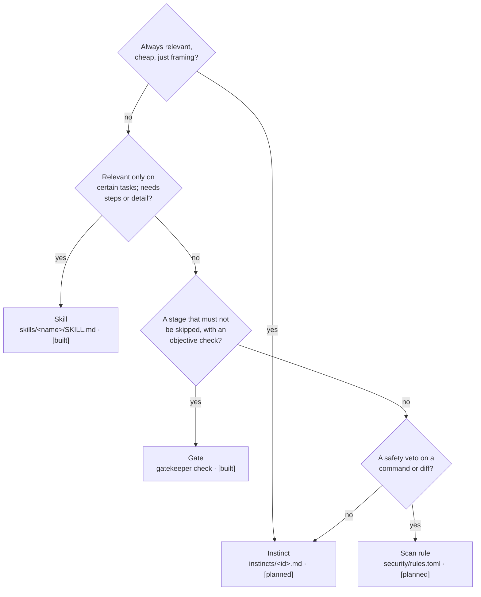

# Extending Topology

How a human or an agent adds to the operator system. This is the contributor methodology — the way
the toolset grows. Read [`../METHODOLOGY.md`](../METHODOLOGY.md) first for the concepts; this is the
how-to.

Tags: `[built]` works today, `[planned]` lands on the [roadmap](ROADMAP.md).

---

## 1. First decide: which operator?

Everything you add is an **operator**. Put it at the *weakest enforcement that still works* — adding
strength has a cost (tokens, friction, false vetoes), so earn it.



Fallback decision list:

- **Always-on, cheap, framing the agent's reasoning** → **instinct**
- **Task-specific knowledge or a multi-step procedure** → **skill**
- **A stage that must block until an objective check passes** → **gate**
- **A deterministic safety veto on a tool call** → **scan rule**

If two fit, start with the weaker one and *promote* later (see §6) when evidence demands it.

---

## 2. Add a skill `[built]`

A skill is a directory with a `SKILL.md`.

```bash
./scripts/new-skill.sh my-skill        # scaffold from the template
```

Write the frontmatter in the **house format** (`AGENTS.md`): a verb phrase for *what it does*, then
*when to use it* in the user's own vocabulary — third person, one line, slightly pushy (agents
under-trigger):

```markdown
---
name: postgres-migrations
description: Writes safe, reversible Postgres migrations. Use when adding or changing database
  schema, columns, indexes, or running a data backfill.
---

# Postgres migrations

## When to use
<concrete triggers, in the user's words>

## Process
1. ...

## Common rationalizations (rebutted)
| Excuse | Reality |
|--------|---------|
| "It's just one column." | A column add under load still locks; use the safe pattern. |
```

Rules of the house:

- **One skill, one job.** Keep the `SKILL.md` body under ~5k tokens; push detail into `references/`.
- **Constraints as reasoning**, not bare commands (the *why* generalizes).
- For a skill that should be **keyword-routed**, add an entry to `hooks/skill-rules.json`:
  ```json
  "postgres-migrations": {
    "type": "domain",
    "enforcement": "suggest",
    "priority": "medium",
    "promptTriggers": { "keywords": ["migration", "schema", "column", "index", "backfill"] }
  }
  ```
- Verify it routes: `echo "add a column to users" | gatekeeper activate` and `gatekeeper list`.
- If it fails to trigger, **widen** the trigger language; if it over-triggers, **narrow** its scope.

---

## 3. Add an instinct `[planned]`

Instincts are tiny, always-on nudges. One file per instinct under `instincts/`:

```markdown
---
id: evidence-over-assertion
applies: always              # "always", a language, or a glob like "**/*.kt"
priority: high
---
Claim "done" only with a command someone can re-run and output they can see. "I'm confident" is not
evidence — it's the failure mode that verification exists to catch.
```

- Keep it to a sentence or two — it's loaded *every* prompt.
- Phrase the **reasoning**, never a bare prohibition.
- Scope with `applies` so a Kotlin instinct doesn't fire on a docs-only task.
- Verify: `gatekeeper instinct list` and `gatekeeper instinct render --harness claude`.

---

## 4. Add a scan rule `[planned]`

Security rules live in `security/rules.toml`. A rule is a pattern + a verdict + a human-readable
message:

```toml
[[rule]]
id        = "gcp-service-account-key"
kind      = "secret"          # secret | command | pattern
pattern   = "\"type\":\\s*\"service_account\""
severity  = "block"           # block | warn
message   = "GCP service-account key detected — never commit it; use workload identity."
```

- `block` vetoes (exit 1); `warn` annotates but allows.
- Write the `message` as the *fix*, not just the diagnosis (Anthropic: actionable errors).
- Verify: `gatekeeper scan --diff < some.patch` blocks the bad case and passes a clean one; add a
  `#[cfg(test)]` case in `scan.rs` for the rule.

---

## 5. Add or change a gate `[built, advanced]`

Gates are the only operator that lives in Rust, because a gate is a deterministic check. To add one,
extend `gatekeeper/src/main.rs`:

1. Add the subcommand arm in `cmd_check` (mirror `gate_doc_exists` / `gate_plan`).
2. Implement the check — reuse `find_doc(sub, feature)` for "an artifact exists" gates, or run a
   command for "it passes" gates (mirror `gate_finish`).
3. Add a `#[cfg(test)]` test next to the existing ones.
4. If it belongs in the spine, document it in `METHODOLOGY.md` §4 and `AGENTS.md`'s gate sequence.
5. `cargo fmt && cargo clippy -- -D warnings && cargo test` before finishing.

Keep gates **objective** — "a file matching the feature slug exists", "this command exits 0". If you
can't write the check as code, it's a skill or an instinct, not a gate.

---

## 6. Promote a gotcha `[planned]`

The learning loop turns a recurring failure into a standing operator.

```
failure / correction ─► gatekeeper learn capture ─► docs/learn/<date>-<slug>.md
                                                          │  (recurs?)
                                       human review ◄──────┘
                                                          │  approve
                                  gatekeeper learn promote ─► instinct | skill | scan rule
```

1. **Capture.** On a gate failure or a human correction, `gatekeeper learn capture` appends a
   structured entry to `docs/learn/`.
2. **Review.** A human (or a periodic agent pass) looks for entries that recur.
3. **Promote.** `gatekeeper learn promote` scaffolds the right operator using §2–§4 — chosen via the
   §1 decision tree. **A human approves every promotion**; noise must not harden into policy.

---

## 7. House conventions (all operators)

- **Naming.** Lowercase, hyphenated, ≤64 chars; gerunds read well (`processing-pdfs`). No reserved
  words (`claude`, `anthropic`).
- **The senior-engineer test.** "Would a senior engineer say this is overcomplicated?" If yes, simplify.
- **Surgical.** Add what the change needs; don't refactor adjacent operators in passing.
- **Stack rules** (from `AGENTS.md`): Rust runs `cargo fmt` + `cargo clippy -- -D warnings`, tests in
  `#[cfg(test)]`; Bash starts `set -euo pipefail`, POSIX-friendly; Markdown bodies stay under ~5k
  tokens with detail pushed to `references/`.
- **Where things live.** See the target layout in [`ARCHITECTURE.md`](ARCHITECTURE.md#6-target-directory-layout-end-state).

---

## 8. Record the decision

If your change is hard to reverse, surprising without context, and the result of a real trade-off,
add an ADR under [`adr/`](adr/) using the existing numbered format. Most operators don't need one;
architectural choices do.
