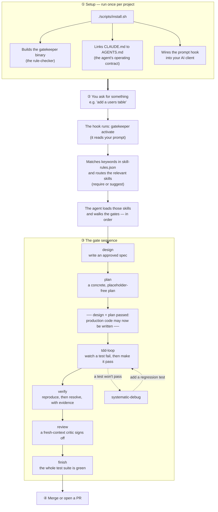
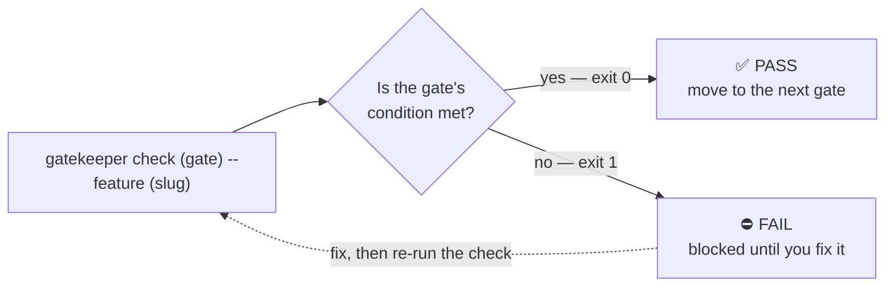

# How Topology Works

*A visual guide for someone **using** Topology to build software with an AI coding agent. For the
internal layered design read [ARCHITECTURE.md](ARCHITECTURE.md); for the build order, [ROADMAP.md](ROADMAP.md).*

Topology sits between you and your AI coding agent. Instead of *hoping* the agent remembers good
practice, it turns each step of the methodology into an objective **gate** that a small Rust binary
(`gatekeeper`) can actually check. You install it once; from then on every coding task flows through
the same checkpoints — and the agent can't skip one by "feeling confident."

---

## 1. The whole picture — install once, then every task walks the gates



ASCII fallback:

```
①  SETUP (once)
    ./scripts/install.sh
        ├─ builds the gatekeeper binary (the rule-checker)
        ├─ links CLAUDE.md → AGENTS.md (the agent's contract)
        └─ wires the prompt hook into your AI client
                              │
②  YOU ASK ──────────────────▼  "add a users table"
                       gatekeeper activate  (hook reads your prompt)
                              │  routes skills from skill-rules.json (require | suggest)
                              ▼
③  THE GATE SEQUENCE   (the agent walks these in order)

      design ──► plan ──►[ code may now be written ]──► tdd-loop ──► verify ──► review ──► finish
                                                           ▲  │
                                          regression test  │  ▼  test won't pass
                                                      systematic-debug
                              │
④  SHIP ─────────────────────▼  merge / open a PR
```

**Read it as a story.** You install Topology once (①). After that, every request you type (②) is
read by a hook that routes in the right skills, and the agent must then pass each gate in sequence
(③) before it can ship (④). The bar after **plan** is the rule that gives Topology its teeth: *no
production code is written until the design and plan gates pass.*

---

## 2. What each gate checks (built today)

Each gate is a verb the agent performs **and** an objective check anyone can re-run. The check is the
gate — not a promise, a command with a pass/fail answer.

| Gate | What gets produced | How it's checked | Passes when |
|------|--------------------|------------------|-------------|
| **design** | an approved spec in `docs/specs/` | `gatekeeper check design --feature <slug>` | the spec file exists |
| **plan** | a step-by-step plan in `docs/plans/` | `gatekeeper check plan --feature <slug>` | the plan exists **and** has no placeholder words (`TBD`, "implement later", …) |
| **tdd-loop** | tests written *before* the code | discipline gate — no check command | every unit of behavior had a test you watched fail first |
| **verify** | a verification note in `docs/verify/` | `gatekeeper check verify --feature <slug>` | the note exists |
| **review** | a fresh critic's artifact in `docs/reviews/` | `gatekeeper check review --feature <slug> [--base <ref>]` | the artifact passes for the clean `HEAD`: bound to the merge-base, both rubric dimensions present, no blocking findings |
| **finish** | a green test run | `gatekeeper check finish -- <your test command>` | the command exits `0` |

---

## 3. Anatomy of a single gate — why it can't be skipped

Every `gatekeeper check` answers with an **exit code**, the same way every Unix tool does. That's
what makes a gate enforceable by a human, by the agent, *and* by CI — they all read the same signal.



ASCII fallback:

```
   gatekeeper check <gate> --feature <slug>
                  │
                  ▼
        is the condition met?
          ╱               ╲
   exit 0 ╱                 ╲ exit 1
        ▼                    ▼
   ✅ PASS                ⛔ FAIL
   next gate          blocked — fix, then re-run ──┐
        ▲                                          │
        └──────────────────────────────────────────┘
```

**Gates, not rules.** A *rule* ("verify before asserting") has an invisible opt-out — the agent
skips it when it feels sure. A *gate* is a hard block with a testable criterion: `exit 0` = pass,
`exit 1` = fail, `exit 2` = you used it wrong. There is no "I'm confident" path around a non-zero
exit code. (You saw this live: a `check review` run **fails closed** the moment the working tree has
uncommitted changes — the gate refuses to bless code it can't pin to a clean commit.)

---

## 4. What runs today vs. what's coming

This guide describes what is **built and tested today**: the six gates above, keyword skill-routing
through the prompt hook, and the one-command installer — all enforced by the `gatekeeper` binary
(42 tests green, `fmt`/`clippy` clean).

Designed and on the [roadmap](ROADMAP.md), **not yet built**:

- a **security veto** that blocks secrets and dangerous commands *before* they run or get committed,
- an always-on **instincts** layer (soft, reasoning-based nudges injected every session),
- **continuous learning** that promotes recurring failures into new gates/rules, and
- native **Codex / Cursor / OpenCode** support generated from this one Markdown source.

Those layers slot into the same picture: routing and instincts wrap step ②, the security veto guards
every tool call inside step ③, and learning feeds step ④'s lessons back to the top.
