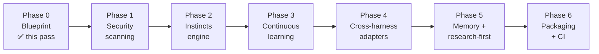

# Roadmap

The path from today's Topology (gates + Claude Code) to the full operator system. Each phase is a
separately-approved unit of work with its own deliverables and a concrete **verify** check — nothing
is "done" without a check that proves it.

> This is the plan, not a changelog. **Phase 0** is delivered, plus the **code-review gate** pulled forward from Phase 5 (Phase 1.5 below). Phases 1–6 are otherwise designed and
> ordered, not built. See [`../METHODOLOGY.md`](../METHODOLOGY.md) and [`ARCHITECTURE.md`](ARCHITECTURE.md).

**Why this order.** Security is the biggest true gap, so it's front-loaded (Phase 1). Instincts
(Phase 2) must exist before learning (Phase 3), because learning *promotes* gotchas into instincts —
the target has to be there first. Adapters (Phase 4) come once there's a rich operator set worth
fanning out. Memory/research hardening (Phase 5) and packaging (Phase 6) finish the system.

---

## Phase 0 — Blueprint ✅ (this pass)

**Goal.** A reviewable design any contributor can read, and a path to build it.

**Deliverables.** `METHODOLOGY.md`, `docs/ARCHITECTURE.md`, `docs/ROADMAP.md`, `docs/EXTENDING.md`,
five ADRs under `docs/adr/`, and a surgical `README.md` update. No code.

**Verify.** Every pillar (6) and harness (4) has a named section; Mermaid blocks parse and have ASCII
fallbacks; internal links resolve; Phases 1–6 are framed as *planned*, not done.

---

## Phase 1 — Security scanning *(front-loaded)*

**Goal.** A deterministic safety floor: no secret or dangerous command reaches execution or history.

**Deliverables.**
- `gatekeeper/src/scan.rs` — diff/command scanner (reuses `json.rs`; std-only regex or a vetted dep).
- `security/rules.toml` — seed rules (cloud keys, private keys, `rm -rf /`, pipe-to-shell, history rewrite).
- `hooks/security-scan.sh` — `PreToolUse` glue (block on non-zero).
- `hooks/pre-commit.sh` — pre-commit glue scanning the staged diff.
- `skills/security-scanning/SKILL.md` — when/how the agent invokes and responds to a veto.

**New `gatekeeper` surface.** `gatekeeper scan --diff` (stdin) and `gatekeeper scan --cmd "<c>"`,
exit `0` clean / `1` veto.

**Verify.** A planted AWS key and a `curl … | sh` are **blocked**; a clean diff/command **passes**;
`cargo test` covers each rule kind; the `PreToolUse` hook blocks a real tool call end to end.

**Depends on.** Phase 0.

---

## Phase 2 — Instincts engine

**Goal.** Always-on, reasoning-based guardrails, cheaper than skills, injected every session.

**Deliverables.**
- `instincts/` directory + the `<id>.md` format (frontmatter `applies` / `priority`, body = the *why*).
- `gatekeeper/src/instinct.rs` — load + filter by `applies`, render plain or per-harness.
- `activate` extended to inject matching instincts alongside routed skills.
- A seed set (≈6–10): constructor injection, no platform types in shared code, evidence-over-assertion, etc.

**New `gatekeeper` surface.** `gatekeeper instinct list`, `gatekeeper instinct render --harness <h>`;
`activate` now emits instincts.

**Verify.** Instincts appear in the session preamble for each wired harness; an `applies` glob scopes
correctly (a Kotlin instinct doesn't fire on a Markdown-only prompt); `cargo test` covers filtering.

**Depends on.** Phase 0. (Independent of Phase 1; orderable either way.)

---

## Phase 3 — Continuous learning

**Goal.** Failures and corrections become permanent operators — the system tightens where it's burned.

**Deliverables.**
- `gatekeeper/src/learn.rs` — capture (append a structured gotcha) + promote (scaffold an operator).
- `docs/learn/` — the gotcha ledger.
- `skills/capture-gotcha/SKILL.md` — recognize a recurring failure and route it into the ledger.
- Promotion path: a ledger entry → a new `instinct`, `skill`, or `security/rules.toml` rule, **human-approved**.

**New `gatekeeper` surface.** `gatekeeper learn capture` (on Stop/gate-failure), `gatekeeper learn promote`.

**Verify.** A forced gate failure writes a ledger entry; `promote` produces a *valid* instinct/skill/rule
file (parses, passes `gatekeeper list`/scan-load); promotion requires explicit human confirmation.

**Depends on.** Phase 2 (promotes into instincts) and Phase 1 (promotes into scan rules).

---

## Phase 4 — Cross-harness adapters

**Goal.** Native Codex, Cursor, and OpenCode support generated from the one Markdown source.

**Deliverables.**
- `gatekeeper/src/adapt.rs` + `adapters/` templates per harness.
- Codex: generate `.codex/config.toml` agents + ensure `AGENTS.md` carries the contract.
- Cursor: generate `.cursor/rules/*.mdc` (globs from each skill's `applies`).
- OpenCode: generate `opencode.json` + `.opencode/skills/` from `skills/`.
- Per-harness install paths in `scripts/install.sh`.

**New `gatekeeper` surface.** `gatekeeper adapt --harness {codex|cursor|opencode|claude}`.

**Verify.** Each generated config loads in its harness without error; a routing keyword fires the right
skill in each; regenerating is idempotent (no drift vs. a hand check).

**Depends on.** Phases 1–3 (there must be operators worth fanning out).

---

## Phase 5 — Memory + research-first hardening

**Goal.** Make context a managed budget and exploration a gated stage.

**Deliverables.**
- `memory/` protocol — handoff + compaction artifact format; `gatekeeper` helpers to write/read them.
- RTK integration documented and wired as the default shell proxy.
- `research` gate: `gatekeeper check research` + `skills/research-first/SKILL.md`, prepended to the sequence.
- Domain skills for the house stack. *(The `code-review` critic skill + `review` gate were pulled forward and delivered 2026-06-05 — see `docs/adr/0006-code-review-gate.md`.)*

**New `gatekeeper` surface.** `gatekeeper check research --feature <slug>`; memory read/write helpers.

**Verify.** The `research` gate blocks `design` when no research note exists; a handoff artifact
round-trips (write → fresh session → resume); the `code-review` subagent returns findings against the plan.

**Depends on.** Phase 4 (research-first skill should ship to all harnesses).

---

## Phase 6 — Packaging & distribution

**Goal.** One-command install per harness, pinned and CI-guarded.

**Deliverables.**
- Per-harness installer flows + plugin manifests (`.claude-plugin/`, equivalents).
- Version pinning (gatekeeper + rules schema versions).
- CI: `cargo test` / `cargo fmt --check` / `cargo clippy -- -D warnings` + a docs link/coverage lint.

**New `gatekeeper` surface.** `gatekeeper --version`; a `gatekeeper doctor` health check (optional).

**Verify.** A clean-machine install works for each harness; CI is green on a fresh clone; a tagged
release ships a static binary.

**Depends on.** Phases 1–5.

---

## Status at a glance

| Phase | Capability | Status |
|---|---|---|
| 0 | Blueprint (docs + diagrams + roadmap) | ✅ delivered |
| 1 | Security scanning | ⏳ planned (next) |
| 1.5 | Code-review gate (pulled forward) | ✅ delivered |
| 2 | Instincts engine | ⏳ planned |
| 3 | Continuous learning | ⏳ planned |
| 4 | Cross-harness adapters | ⏳ planned |
| 5 | Memory + research-first | ⏳ planned |
| 6 | Packaging & CI | ⏳ planned |
