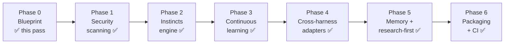
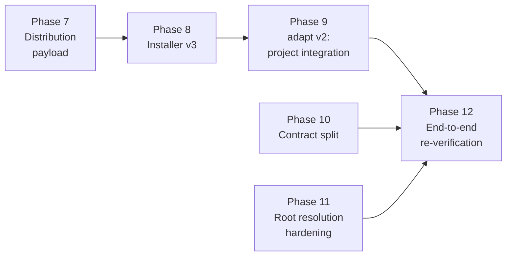
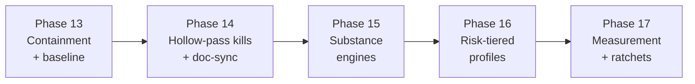

# Roadmap

The path from today's Topology (gates + Claude Code) to the full operator system. Each phase is a
separately-approved unit of work with its own deliverables and a concrete **verify** check — nothing
is "done" without a check that proves it.

> This is the plan, not a changelog. **Phase 0**, **Phase 1 (security scanning)**, the
> **code-review gate** (Phase 1.5), **Phase 2 (instincts engine)**, **Phase 3 (continuous learning)**, and
> **Phase 4 (cross-harness adapters)**, **Phase 5 (memory + research-first)**, and **Phase 6 (packaging & distribution)** are delivered. See
> [`../METHODOLOGY.md`](../METHODOLOGY.md) and [`ARCHITECTURE.md`](ARCHITECTURE.md).
> **Phase 7 (distribution payload)**, **Phase 13 (day-zero containment, v0.4.1)**, and **Phase 14
> (hollow-pass kills, v0.5.0)** are also delivered. The active track is **Phases 8–12
> (distribution vs. repository)** — separating what a governed project receives from the
> framework's own development repo.
> Queued behind it: the rest of **Track 3 (Phases 15–17, gate substance & proportional process)** —
> hardening *what the gates verify*, per the 2026-06-11 five-failure-modes audit
> ([plan](plans/2026-06-11-five-failure-modes-roadmap.md)). Phase 15's default flips are gated on
> Phase 14 shadow burn-in data (<2% false-block per gate, ≥50 evaluations each), not the calendar.







**Why this order.** Security is the biggest true gap, so it's front-loaded (Phase 1). Instincts
(Phase 2) must exist before learning (Phase 3), because learning *promotes* gotchas into instincts —
the target has to be there first. Adapters (Phase 4) come once there's a rich operator set worth
fanning out. Memory/research hardening (Phase 5) and packaging (Phase 6) finish the system.

---

## Phase 0 — Blueprint ✅ (this pass)

**Goal.** A reviewable design any contributor can read, and a path to build it.

**Deliverables.** `METHODOLOGY.md`, `docs/ARCHITECTURE.md`, `docs/ROADMAP.md`, `docs/EXTENDING.md`,
five ADRs under `docs/adr/`, and a surgical `README.md` update. No code.

**Verify.** Every pillar (6) and harness (4) has a named section; Mermaid blocks parse and have ASCII
fallbacks; internal links resolve; Phases 1–6 are framed as *planned*, not done.

---

## Phase 1 — Security scanning ✅ *(front-loaded, delivered 2026-06-06)*

**Goal.** A deterministic safety floor: no secret or dangerous command reaches execution or history.

**Deliverables.**
- `gatekeeper/src/scan.rs` — content/command scanner over `security/rules.toml` (ReDoS-safe `RegexSet`; `serde`/`toml`/`serde_json` per ADR-0007; `json.rs` retired).
- `security/rules.toml` — seed rules (cloud keys, private keys, `rm -rf /`, pipe-to-shell, history rewrite).
- `hooks/security-scan.sh` — `PreToolUse` glue (emits deny/ask JSON; fail-closed).
- `hooks/pre-commit.sh` — pre-commit glue scanning the staged blobs + protected-path integrity.
- `skills/security-scanning/SKILL.md` — when/how the agent invokes and responds to a veto.

**`gatekeeper` surface.** `gatekeeper scan --hook` (PreToolUse JSON on stdin), `--cmd`/`--content`
(stdin), `--staged` (git index), `--check-path <p>`; exit `0` clean / `1` veto / `2` fail-closed.

**Verify.** A planted AWS key and a `curl … | sh` are **blocked**; a clean diff/command **passes**;
`cargo test` covers each rule kind; the `PreToolUse` hook blocks a real tool call end to end. Evidence:
`docs/verify/2026-06-06-security-scanning.md`.

**Depends on.** Phase 0.

---

## Phase 2 — Instincts engine ✅ *(delivered 2026-06-08)*

**Goal.** Always-on, reasoning-based guardrails, cheaper than skills, injected every session.

**Deliverables.**
- `instincts/` directory + the `<id>.md` format (frontmatter `id` / `priority` / optional `source`; body = the *why*). Instincts carry **no scope** — always-on.
- `gatekeeper/src/instinct.rs` — hand-rolled frontmatter parser, directory loader (sorted, deduped, fail-mode matrix), preamble renderer with word-budget truncation, `cmd_instinct` (list/render), `activate_section`.
- `activate` extended to inject the always-on instinct set alongside routed skills.
- Six seed instincts: `constraints-as-reasoning`, `evidence-over-assertion`, `gates-not-rules` (high); `surgical-changes-only`, `three-language-lanes` (high), `weakest-enforcement-that-works` (medium).

**New `gatekeeper` surface.** `gatekeeper instinct list`, `gatekeeper instinct render --harness <h> [--budget <n>]`;
`activate` now emits instincts.

**Verify.** `gatekeeper activate` injects the always-on instincts under the `Always-on instincts —`
header for any prompt; a missing `instincts/` dir yields no instincts and exit 0; `gatekeeper instinct
render --harness claude` reproduces the same bodies. Evidence: `docs/verify/2026-06-07-instincts-engine.md`.

**Depends on.** Phase 0. (Independent of Phase 1; orderable either way.)

---

## Phase 3 — Continuous learning ✅ *(delivered 2026-06-08)*

**Goal.** Failures and corrections become permanent operators — the system tightens where it's burned.

**Deliverables.**
- `gatekeeper/src/learn.rs` — capture (append a structured gotcha to the append-only ledger) + promote
  (scaffold an operator; validate it against that operator's own loader; print a diff; write only on
  explicit human confirmation).
- `docs/learn/` — the gotcha ledger (`ledger.md`) + a `README.md` describing the entry format and the loop.
- `skills/capture-gotcha/SKILL.md` — recognize a recurring failure and route it (wired into
  `hooks/skill-rules.json`); `hooks/learn-capture.sh` — an opt-in `Stop` hook for automated capture.
- Promotion path: a ledger entry → a new `instinct`, `skill`, or `security/rules.toml` rule, **human-approved**.

**New `gatekeeper` surface.** `gatekeeper learn capture` (on Stop/gate-failure), `gatekeeper learn list`,
`gatekeeper learn promote`.

**Verify.** `learn capture` appends a parseable `## <id>` entry to `docs/learn/ledger.md` (and a recurrence
is the same id captured again — `learn list` shows the occurrence count); `learn promote --kind instinct`
writes an `instincts/<id>.md` (with `source: ledger:<id>`) that passes `gatekeeper instinct list`,
`--kind skill` writes a `skills/<id>/SKILL.md` that appears in `gatekeeper list`, and `--kind rule
--pattern <re>` appends a `[[rule]]` that `gatekeeper scan` loads; a declined promotion (no `y`) writes
nothing. Evidence: `docs/verify/2026-06-08-continuous-learning.md`.

**Depends on.** Phase 2 (promotes into instincts) and Phase 1 (promotes into scan rules).

---

## Phase 4 — Cross-harness adapters ✅ *(delivered 2026-06-08, ahead of Phase 3)*

**Goal.** Native Codex, Cursor, and OpenCode support generated from the one Markdown source.

**Deliverables.**
- `gatekeeper/src/adapt.rs` — pure `root -> Vec<GenFile>` builders + `apply_or_check` (a `--check`
  idempotency mode); `adapters/README.md` documents the per-harness mapping. No new crates.
- Codex: generate `.codex/config.toml` (project-safe `project_doc_max_bytes`, validated against
  `codex --strict-config`); the contract rides on the auto-discovered `AGENTS.md`. (Project-local config
  may not carry `profiles`/provider keys, so there are no "Codex agents/profiles" — see ADR-0008.)
- Cursor: generate `.cursor/rules/*.mdc` — always-on **instincts** and the `AGENTS.md` contract map to
  Cursor's **Always** mode; keyword-routed **skills** map to **Agent Requested** (description-based — the
  closest primitive, since Cursor has no keyword router; see ADR-0008).
- OpenCode: generate `opencode.json` (`instructions`) + `.opencode/instincts.md` + `.opencode/skills/`
  copied from `skills/`.
- Claude: generate `.claude/settings.json` (the hook wiring) — the source-native harness as a uniform
  generated target. `scripts/install.sh` documents the opt-in `adapt` commands.

**New `gatekeeper` surface.** `gatekeeper adapt --harness {codex|cursor|opencode|claude} [--check]`.

**Verify.** `gatekeeper adapt --harness <h>` writes each harness's native files; the generated
`.codex/config.toml` loads under `codex --strict-config`; `opencode.json` / `.claude/settings.json` are
valid JSON in the documented schema; copied skills are byte-equal; `--check` is idempotent (exit 0) and
flags drift (exit 1). Evidence: `docs/verify/2026-06-08-cross-harness-adapters.md`.

**Depends on.** Phase 2 (instincts to fan out) + the skill set. Phase 3's learning loop is **not** a
prerequisite — it only adds more operators to fan out later, so Phase 4 shipped first.

---

## Phase 5 — Memory + research-first hardening ✅ *(delivered 2026-06-08)*

**Goal.** Make context a managed budget and exploration a gated stage.

**Deliverables.**
- `memory/` protocol — handoff artifact format (one kind; the `compaction` kind was cut — a handoff written before context fills serves the same purpose); `gatekeeper memory write/read/list` helpers, with secret-refusal on the rendered artifact and `memory/artifacts/` write-protection.
- RTK integration documented and wired as the default shell proxy.
- `research` gate: `gatekeeper check research` + `skills/research-first/SKILL.md`, prepended to the sequence.
- The `resume` session-lifecycle skill (read handoff → verify state → act). *(Domain skills for the house stack are deferred — not part of the executed plan. The `code-review` critic skill + `review` gate were pulled forward and delivered 2026-06-05 — see `docs/adr/0006-code-review-gate.md`.)*

**New `gatekeeper` surface.** `gatekeeper check research --feature <slug>`; memory read/write helpers.

**Verify.** The `research` gate blocks `design` when no research note exists; a handoff artifact
round-trips (write → fresh session → resume); the `code-review` subagent returns findings against the plan.
**Evidence:** [`docs/verify/2026-06-08-memory-research-first.md`](verify/2026-06-08-memory-research-first.md) — all 11 acceptance criteria checked, quality gates green (198 passed / 2 ignored, no dependency change).

**Depends on.** Phase 4 (research-first skill should ship to all harnesses).

---

## Phase 6 — Packaging & distribution ✅ *(delivered 2026-06-09)*

**Goal.** One-command install per harness, pinned and CI-guarded.

**Deliverables.**
- Per-harness installer flows + plugin manifests (`.claude-plugin/`, equivalents).
- Version pinning (gatekeeper + rules schema versions).
- CI: `cargo test` / `cargo fmt --check` / `cargo clippy -- -D warnings` + a docs link/coverage lint.

**New `gatekeeper` surface.** `gatekeeper --version`; a `gatekeeper doctor` health check (optional).

**Verify.** A clean-machine install works for each harness; CI is green on a fresh clone; a tagged
release ships a single std-only macOS-arm64 binary (it dynamically links `libSystem`).
**Evidence:** [`docs/verify/2026-06-09-packaging-distribution.md`](verify/2026-06-09-packaging-distribution.md) — all 12 acceptance criteria checked, quality gates green (213 passed / 2 ignored, no dependency change), `claude plugin validate .` passed.

**Addendum (2026-06-10):** Prebuilt-binary distribution (four-target release matrix, installer download, plugin self-provisioning) delivered as a follow-on. Decision: [ADR-0011](adr/0011-prebuilt-binary-distribution.md). Verify: [`docs/verify/2026-06-10-one-command-install.md`](verify/2026-06-10-one-command-install.md).

**Addendum (2026-06-10):** Guided installer (harness/scope prompts), project-local artifact root (`.claude/topology/`), stale-PATH repair delivered as a follow-on. Decision: [ADR-0012](adr/0012-project-root-vs-framework-root.md). Verify: [`docs/verify/2026-06-10-installer-v2.md`](verify/2026-06-10-installer-v2.md).

**Depends on.** Phases 1–5.

---

# Track 2 — Distribution vs. repository (Phases 7–12)

**The problem (found 2026-06-10, verifying installer-v2 against `react-weather-app`).** "Install"
means "clone the dev repo": a governed project receives the gatekeeper source, the framework's own
`docs/`, `RESEARCH.md`, and the full git history — the workshop instead of the tool — while the one
artifact it genuinely needs, the operating contract in **its own** `CLAUDE.md`/`AGENTS.md`, is never
delivered (Claude Code does not read `.topology/CLAUDE.md`). Two outright bugs compound it: the
pre-commit hook installs into `.topology/.git/hooks/` (guarding the vendored copy, not the project),
and the post-install `doctor` runs from inside `.topology/`, so it reports project == framework and
`artifacts root: .topology/docs` — verifying the wrong world.

**The fix in one line.** Introduce a **distribution payload** distinct from the repository, and make
`adapt` deliver the contract into the governed project.

**Decisions (2026-06-10).**
- **Plugin channel retired.** The Claude Code plugin path (`/plugin install topology@topology`,
  SessionStart self-provisioning) is untested and duplicates the installer; remove it rather than
  port it to the payload model (Phase 8).
- **Upgrade = replace `.topology/` wholesale.** A local-customization overlay is deferred; forking
  the framework is the interim customization story. `react-weather-app` is the reference fixture
  for upgrade behaviour (Phase 12).
- **Contract delivery is append-only, import-first.** Never clobber or regenerate the user's
  `CLAUDE.md`/`AGENTS.md`. Claude Code: append one `@.topology/CONTRACT.md` import line (create the
  file with just that line when missing) — upgrades then never touch the user's file, because the
  imported contract lives in the payload. Harnesses without imports (codex): append an idempotent
  managed block instead.
- **Project-doc init is agent-driven, first-session, not install-time.** `adapt` stays
  deterministic (bare stub only); the contract / getting-started skill instructs the *first agent
  session* to detect the bare stub and write the project's own documentation above the import.
  `gatekeeper` never calls an LLM. An opt-in `adapt --init-agent` shell-out (claude-only, tty
  prompt, init-then-append order) is a stretch deliverable, not the default.

**Target layout** (local scope; global is the same payload at `~/.topology` with c–f only in the project):

```
<project>/
├── .topology/                  # gitignored, installer-managed, replaceable payload
│   ├── bin/gatekeeper           # (a) the enforcer
│   ├── hooks/*.sh               # (b) routing + scan glue
│   ├── security/rules.toml      # (b)
│   ├── skill-rules.json         # (b)
│   ├── skills/  instincts/      # what activate routes into
│   └── VERSION                  # payload version; drives upgrade/skew checks
├── .claude/
│   ├── settings.json            # (c) hook wiring + GATEKEEPER_BIN env
│   └── topology/                # (d) committed gate artifacts
│       └── research/ specs/ plans/ verify/ reviews/
├── CLAUDE.md                    # (e) managed Topology block (the operating contract)
└── .git/hooks/pre-commit        # (f) into the PROJECT's git, not .topology/.git
```

The payload is harness-neutral, so it does **not** live under `.claude/` — `.claude/topology/` holds
only the project's committed gate artifacts; `.topology/` holds the disposable, versioned payload.

---

## Phase 7 — Distribution payload ✅ *(delivered 2026-06-10)*

**Goal.** A release artifact that is the unit of install — the tool without the workshop.

**Deliverables.** *(Design grilled 2026-06-10; decisions below.)*
- **Platform-neutral payload** (decision: one tarball, not four per-platform ones): CI builds
  `topology-payload.tar.gz` (stable asset name, so `releases/latest/download/` resolves without
  knowing the version; version lives inside) + an entry in the existing `SHA256SUMS`. Contents:
  `hooks/{skill-activation,security-scan,pre-commit,learn-capture}.sh`, `hooks/skill-rules.json`,
  `skills/`, `instincts/`, `security/rules.toml`, `scripts/fetch-gatekeeper.sh` (the installer runs
  it post-unpack; it switches from reading `plugin.json` to the payload `VERSION`), `VERSION`, and
  a reserved `CONTRACT.md` slot (Phase 10). The repo layout already matches the payload layout —
  assembly is a copy list. The platform-specific binary rides the existing four-target release
  pipeline and is fetched into the payload's `bin/` at install time.
- Explicitly excluded: `gatekeeper/` source, `docs/`, `RESEARCH.md`, `METHODOLOGY.md`, `.github/`,
  `.claude-plugin/`, git history, `memory/TEMPLATE.handoff.md` (compiled into the binary via
  `include_str!`), `adapters/` (documentation only), `hooks/ensure-gatekeeper.sh` + `hooks/hooks.json`
  (plugin-only; retired in Phase 8).
- `VERSION` file: line-anchored TOML (`version`, `rules_schema`) — parseable by the bash `grep`
  idiom and the `toml` crate alike; consumed by `doctor`, the stale-binary check, and
  `fetch-gatekeeper.sh`. Version resolution (decision): the installer always takes the **latest
  release** (`TOPOLOGY_VERSION` env overrides for pinning/rollback); the single source of truth is
  `gatekeeper/Cargo.toml`, tag-guarded by CI.
- **The payload is read-only at runtime** (decision): `gatekeeper` never writes inside it after
  install. Mutable state moves from `framework_root()` to `artifacts_root()` — memory handoffs to
  `.claude/topology/memory/`, the learn ledger to `.claude/topology/learn/ledger.md` in governed
  projects (the framework repo's ledger path is unchanged; its `memory/artifacts/` migrates to
  `docs/memory/`). `learn promote` becomes framework-only: in a governed project it refuses and
  points at the fork story, instead of writing into the replaceable payload.

**Verify.** A tagged release carries the payload; unpacking it yields a tree where
`bin/gatekeeper --version` (post-fetch), `activate`, and `scan` all work with `TOPOLOGY_ROOT`
pointed at the unpacked dir; the tarball contains no `*.rs`, no `docs/`, no `.git`; `memory write`
and `learn capture` in a governed fixture write under `.claude/topology/`, and `learn promote`
there refuses.

**Depends on.** Phase 6 (release matrix exists).

---

## Phase 8 — Installer v3

**Goal.** Both scopes consume the payload; the install verifies the world the user will run in.

**Deliverables.**
- `install.sh` downloads + unpacks the payload to `~/.topology` (global) or `<project>/.topology`
  (local) instead of `git clone`; `--build-from-source` remains, building *into* the payload layout.
- Pre-commit hook installed into the **project's** `.git/hooks/pre-commit` (fix the `$ROOT/.git`
  target bug).
- The `sudo ln -sf … /usr/local/bin` suggestion removed (superseded by `GATEKEEPER_BIN` wiring in
  Phase 9); stale-PATH repair retained.
- Post-install `doctor` runs from the **project root**, not from inside the payload.
- **Retire the plugin channel**: remove `.claude-plugin/` (manifest + marketplace listing), the
  SessionStart self-provisioning hook (`hooks/ensure-gatekeeper.sh`, `hooks/hooks.json`), and the
  plugin sections from `README.md` and the installer's post-install notes. One install channel:
  this script.
- **Legacy-clone migration** (decision 2026-06-10): on detecting a clone-based `.topology/` (has
  `.git`), rescue mutable state into the artifacts root (`memory/artifacts/*` →
  `.claude/topology/memory/`, `docs/learn/ledger.md` → `.claude/topology/learn/`), prompt before
  deleting the clone (`--yes` honors the non-interactive path), then unpack the payload in its
  place. No silent deletion; no clone-beside-payload state.

**Verify.** Local install of a fixture project: `.topology/` contains payload files only; the
fixture's own `.git/hooks/pre-commit` blocks a planted secret; `doctor` (run from the fixture root)
reports project root = fixture, framework root = payload, artifacts root =
`<fixture>/.claude/topology`.

**Depends on.** Phase 7.

---

## Phase 9 — `adapt` v2: project integration

**Goal.** `adapt` delivers everything a governed project needs — including the contract.

**Deliverables.**
- Scaffold `.claude/topology/{research,specs,plans,verify,reviews}/` in the project.
- `.claude/settings.json` gains an `env` block setting `GATEKEEPER_BIN` to the resolved binary path,
  so `gatekeeper check …` works for the agent with no PATH or sudo step.
- Deliver the operating contract **append-only, import-first**: for Claude Code, append one
  `@.topology/CONTRACT.md` import line to the project's `CLAUDE.md` (create the file with just that
  line when missing) — the contract body lives in the payload, so upgrades never touch the user's
  file. For harnesses without imports (codex `AGENTS.md`), append an idempotent **managed block**
  (begin/end markers; re-running updates the block in place; `--check` flags drift). Never clobber
  or regenerate user content in either mode.
- Equivalent contract delivery for cursor/opencode targets (each harness's native
  always-on surface).
- First-session init: the contract (or `_getting-started` skill) gains a gate-shaped instruction —
  *project doc is a bare Topology stub → analyze the codebase and write the project's documentation
  above the import → then proceed*. Stretch: opt-in `adapt --init-agent` (claude-only, tty-prompted,
  runs `claude -p "/init"` **before** appending the import).

**Verify.** On a fixture with a pre-existing `CLAUDE.md`: one `adapt` run appends only the import
line and touches nothing else; a second run is a no-op (`--check` exits 0); on a fixture with no
`CLAUDE.md`, the file is created with just the import; the codex managed block round-trips
(edit → re-run → restored); a Claude Code session in the fixture sees the gate sequence in context
and `gatekeeper check design --feature x` runs bare; on a bare-stub fixture, the first session is
instructed to write the project's documentation above the import.

**Depends on.** Phase 8 (payload paths to point at); Phase 10 (the template it injects).

---

## Phase 10 — Contract split

**Goal.** Separate the portable operating contract from the framework-dev conventions now conflated
in `AGENTS.md`.

**Deliverables.**
- A portable **contract template** (ships in the payload): gate sequence, rules-vs-gates framing,
  `gatekeeper` commands with the resolved binary path, **parameterized artifact paths**
  (`.claude/topology/…` for governed projects — fixing the hardcoded `docs/specs/…` in today's
  `AGENTS.md`), and the memory/compaction protocol. `adapt` renders it at inject time (it knows
  both roots) and writes the result to `.topology/CONTRACT.md` — the file the `@import` points at.
- A framework-dev doc (stays in the repo, never ships): the Rust/Bash/Markdown stack conventions,
  skill house format, contribution workflow.
- The framework repo's own `AGENTS.md` becomes contract-template-instantiated-for-the-framework +
  the dev doc — the repo dogfoods its own template.

**Verify.** The payload contains the template and no dev doc; rendering the template for a governed
project yields only `.claude/topology/…` paths; rendering it for the framework repo yields `docs/…`
paths; no skill or instinct references a repo-only path.

**Depends on.** Phase 7 (a payload to ship it in). Parallel with Phases 8–9.

---

## Phase 11 — Root resolution hardening

**Goal.** `framework_root()` can never land somewhere surprising; `doctor` reports the project's
perspective.

**Deliverables.**
- Resolution order: `$GATEKEEPER_BIN`-adjacent payload → `$TOPOLOGY_ROOT` → `<project>/.topology` →
  `~/.topology` — never a bare upward marker walk (kills the `~/skills` hijack, where a run outside
  the repo resolved framework root to `$HOME`).
- `doctor` resolves from the project root, names both roots, and **fails** (non-zero) when a
  governed project resolves project == framework.
- Version-skew check reads the payload `VERSION` against the binary.

**Verify.** Unit tests for each resolution step and the `$HOME`-hijack regression; `doctor` in a
governed fixture exits non-zero when run from inside `.topology/`; skew between `VERSION` and the
binary is reported.

**Depends on.** Phase 7 (`VERSION` exists). Parallel with Phases 8–10.

---

## Phase 12 — End-to-end re-verification

**Goal.** Prove the consumer-visible outcomes on the real reference project.

**Deliverables.** Wipe `react-weather-app`'s current install; run both scopes (`--global`, then
separately `--project`); record the verify artifact.

**Verify.** Five outcomes, each evidenced:
1. the agent sees the operating contract in its context (project `CLAUDE.md` managed block);
2. `gatekeeper check …` runs bare in a session (via `GATEKEEPER_BIN`);
3. the `UserPromptSubmit` and `PreToolUse` hooks fire;
4. the project's own pre-commit blocks a planted secret;
5. a design artifact lands in `<project>/.claude/topology/specs/`.

**Depends on.** Phases 8–11.

---

# Track 3 — Gate substance & proportional process (Phases 13–17)

**The problem (found 2026-06-11, adversarial audit of v0.4.0).** Five failure modes, demonstrated
end-to-end on a hypothetical 25-line fix: process weight is constant regardless of change size
(5 artifacts + 8 commits for 31 LOC); gates verify existence/sequence, not substance — a spec
containing only `Status: approved`, an `assert!(true)` red commit, and an empty verify file all
pass; the released v0.4.0 binary's usage text drifted from the docs *at the tag* (the fix missed
the release); keyword routing is lexical, so "mask bearer tokens" never summons `security-scanning`
("token" appears in no keyword list); and the secret scan is prefix/label-anchored — a live JWT
pasted into a verify artifact commits clean. Full demonstration, remediation design, and KPIs:
[`plans/2026-06-11-five-failure-modes-roadmap.md`](plans/2026-06-11-five-failure-modes-roadmap.md).

**The fix in one line.** Move every gate from the artifact's surface to the system's behavior —
execute claims instead of grepping for them — then, once gates verify substance, scale ceremony by
measured risk.

**Why this order.** Containment first (rules-only patch, zero risk); drift-proofing plus the cheap
substance checks second; the deep engines third; tiering only *after* gates have teeth (tiering
hollow gates is tiering theater); measurement last, so the fixes can't silently rot the way the
usage text did. Deployment doctrine for the whole track: every behavior change ships **shadow-first**
(current behavior as default, log-only verdicts) and flips on burn-in data, never on the calendar —
a self-governing framework must not deadlock its own delivery pipeline.

---

## Phase 13 — Day-zero containment & baseline ✅ *(delivered 2026-06-11, v0.4.1)*

**Goal.** Stop the demonstrated scan bleeding with pure `rules.toml` additions; record the
process-weight baseline that every later KPI divides by.

**Deliverables.**
- `security/rules.toml`: structural JWT rule (`eyJ` three-segment shape), `sk-`-prefix pattern
  tolerant of hyphenated segments (`sk-proj-…` evasion), labeled-assignment generic rule
  (`api_key|auth_token|password|bearer` + value, `warn`).
- Secrets benchmark corpus: `gatekeeper/tests/fixtures/secrets-bench/` (10 synthetic positives,
  5 negatives) + `tests/cli_scan_bench.rs` pinning current detection (~5/10) as the red harness.
- GitHub push protection enabled on the repo (host-side backstop).
- `scripts/metrics.sh`: per-merged-branch CSV (production LOC, artifact LOC, commits, lead time)
  committed as a research note under `docs/research/` — the FM1 denominator.

**New `gatekeeper` surface.** None — rules, fixtures, and scripts only.

**Verify.** Bench detection rises 5/10 → 8/10 with 0/5 false positives; push-protection status
reads `enabled` via the GitHub API; the baseline CSV records median commits/branch and
artifact-to-production ratio (expected ≈8 and ≈5:1).

**Depends on.** Nothing — executable immediately.

---

## Phase 14 — Hollow-pass kills + drift-proof CLI surface ✅ *(delivered 2026-06-12, v0.5.0)*

**Goal.** Make doc/binary drift unrepresentable; close the three cheapest hollow-artifact holes;
build the adversarial fixture suite that defines "done" for the whole track.

**Deliverables.**
- `tests/cli_hollow.rs`: seven hollow fixtures (approved-only spec, empty verify, `assert!(true)`
  red commit, "Looks fine" review, `test_command = "true"`, synonym-dodged plan, zero-tests-run
  finish) — each must be **rejected**; `#[ignore]`-tagged until its fix lands.
- Single dispatch table replacing the hand-rolled match and all nine `USAGE_*` constants — help and
  dispatch iterate the same data; decision recorded as ADR-0014 (*table over clap*; ADR-0007's
  four-dependency constraint holds).
- README↔help sync test (`tests/cli_doc_sync.rs`, zero new deps) wired into `ci.yml` **and** the
  `release.yml` version-guard — the v0.4.0 escape class dies at the tag.
- Verify gate **evidence replay**: parse ` ```evidence ` blocks (`$ command` + `# expect:` lines),
  execute with allowlisted command prefixes, fail-closed (`[verify] mode`, shadow default).
- Design gate **human-commit approval**: the commit flipping `Status:` to approved must carry no
  agent co-author trailer (`[design] approval`, shadow default).
- Finish gate **zero-test floor**: parse runner summaries, fail on zero tests executed
  (`[finish] require_test_count`, shadow default).

**New `gatekeeper` surface.** Config keys `[verify]` / `[design]` / `[finish]`; no new subcommands.

**Verify.** Hollow fixtures for the three hardened gates are rejected (4/7 un-ignored and green);
`grep -c 'pub const USAGE' gatekeeper/src/main.rs` returns 0; the doc-sync test runs in both CI
jobs; ≥90% of existing verify artifacts replay green unchanged (format codified practice, not
invented it).

**Depends on.** Phase 13 (fixture idiom, baseline).

---

## Phase 15 — Substance engines *(target: v0.6.0)*

> **Status (2026-06-14):** all build deliverables are delivered; only the default→enforce flips remain,
> and they are evidence-gated, not unbuilt. **(1) TDD red-green replay** (ADR-0017): `[tdd] mode =
> "history" | "replay"`, worktree replay at the merge-base, shadow-logged in the default `history` mode;
> the `assert!(true)` hollow fixture is now caught. **(2) Entropy scanning** (ADR-0018): rules schema v2
> + `kind = "entropy"` (per-token Shannon entropy), shipped `severity = "warn"` (shadow), with `[scan]
> exclude_paths` and a `sync-gitleaks-rules.sh` review-file generator — a bare 64-hex / 40-char-base64
> token now WARNs where it previously committed clean (FM5). **(3) Path-triggered routing** (PRs #65/#66):
> `pathTriggers.globs` per skill, `gatekeeper route --paths/--staged-paths/--hook`, and an advisory
> PostToolUse hook (`post-tool-routing.sh`) wired into generated settings — an edit touching a
> security-sensitive path surfaces `security-scanning` regardless of prompt wording. **(4) Router eval
> harness** (PR #67): `tests/fixtures/routing-eval.jsonl` (55 intent-labeled prompts) + `cli_route_eval.rs`
> gating recall ≥0.90 / precision ≥0.80 in CI — the shipped router measures **0.956 / 0.921**.
>
> **(5) Burn-in harness** (PR #64) measured the Phase 14 default→enforce flips and the verdict is **DEFER**:
> TDD replay yields only 8 evals over this repo's whole history (the ≥50-eval bar is structurally
> unreachable here) at a 62.5% would-block rate; entropy fires 21.80 WARN/10k (≫ the <1 target). So the
> flips — and promoting entropy from `warn` to `block` — **stay deferred on evidence** (the only open
> Phase 15 item; revisit on accumulated history or a larger downstream repo). (Version label `v0.6.0`
> predates Track 2's bump to v0.9.0.)

**Goal.** The deep fixes — red-green replay, entropy scanning with a synced ruleset, path-triggered
routing, a measured router — and the Phase 14 shadow flips, gated on burn-in data.

**Deliverables.**
- TDD **red-green replay** (`[tdd] mode = "replay"`, ADR-0016): worktree at merge-base + the new
  test files must fail *red* there; `assert!(true)` choreography dies (compile-error-red residual
  is documented and carried to Phase 17 mutation testing).
- Rules **schema v2** with `kind = "entropy"` (Shannon thresholds per charset, `[scan]
  exclude_paths`, warn-then-block burn-in; ADR-0015) — the class fix for unlabeled secrets.
- `scripts/sync-gitleaks-rules.sh`: quarterly, human-reviewed translation of a curated upstream
  ruleset subset into `rules.toml` (provenance header; never auto-merged — `rules.toml` is a
  protected path).
- **Path-triggered routing**: `pathTriggers` globs per skill in `skill-rules.json`; PostToolUse
  hook injects required-skill context when edits touch trigger paths; pre-commit prints
  required-skill reminders for staged protected paths. Security routing keys on what the diff
  *touches*, not how the prompt is phrased.
- **Router eval harness**: ≥50 labeled prompts (`tests/fixtures/routing-eval.jsonl`) with CI
  thresholds — recall ≥0.90 on `require` skills, precision ≥0.80. A semantic/embedding layer is
  explicitly rejected (offline-first, four-dep constraint; the host agent already routes
  semantically — this router is the deterministic backstop).

**New `gatekeeper` surface.** `route --paths <p>` / `route --staged-paths`; `scan` accepts rules
schema 1 and 2; `[tdd]` config table.

**Verify.** All mechanically-checkable hollow fixtures rejected; secrets bench ≥9/10 in-scope with
FP <1 per 10k lines on a full-history replay (env-var indirection stays a *documented* out-of-scope
miss); both audit prompts route correctly; 100% of edits under trigger globs inject the context
line.

**Depends on.** Phase 14 (shadow logs <2% false-block gate the default flips).

---

## Phase 16 — Risk-tiered gate profiles *(target: v0.7.0)*

**Goal.** Ceremony proportional to measured risk — deliberately sequenced *after* the gates verify
substance, so a waived gate is a calculated trade, not an abdication.

**Deliverables.**
- ADR-0017 tier policy: `docs` / `patch` / `feature` profiles classified from the **cumulative
  merge-base diff** (never per-commit — slicing can't downgrade); protected paths force `feature`
  unconditionally; escalation is monotonic (a branch outgrowing `patch` re-owes the waived gates).
- New `profile.rs`: tier + machine-readable reasons; gates resolve the tier first and print
  **visible waivers** (`PASS (waived: profile=patch)`) — never silent; the review artifact records
  tier + reason (audit trail).
- `[profiles]` config (`enabled = false` at ship; flips in v0.8.0 after burn-in), thresholds,
  `force_full_globs` (includes `.github/**`).
- `scripts/metrics.sh` audit join: tier vs merged branches, per release.
- METHODOLOGY.md doctrine amendment in the same PR: gates are never *skipped silently*; they are
  *waived visibly by measured tier*. The `finish` gate is constitutionally un-waivable in every
  profile — encoded as a unit test, not a convention.

**New `gatekeeper` surface.** `gatekeeper profile --base <ref>`.

**Verify.** Patch-tier ceremony drops from 8 commits / 5 artifacts to ≤4 / ≤2; patch-tier median
lead time −40% vs the Phase 13 baseline CSV; tier distribution lands in the 30–60% sanity band;
the post-merge audit shows **zero** protected-path branches on a reduced tier.

**Depends on.** Phases 14–15 enforced by default; Phase 13 baseline.

---

## Phase 17 — Measurement, depth & ratchets *(target: v0.8.0)*

**Goal.** Close the carried residuals (test quality beyond red-green; prose substance) and make
every Track 3 KPI self-reporting — unmeasured gates regress exactly the way unmeasured docs
drifted.

**Deliverables.**
- `gatekeeper stats --since <tag>`: the KPI table (process-to-payload ratio, lead time per tier,
  tier distribution, waiver counts) as markdown + JSON, embedded in release notes.
- Weekly `cargo-mutants --in-diff` CI job (never per-PR; never blocking): surviving mutants on
  changed lines filed as issues; caught-ratio ≥80% on changed lines, ratcheting release-over-release.
- Advisory **prose-substance judge** (`check design --judge` / `check plan --judge`; ADR-0018):
  host-provided `claude -p`, pinned model, temperature 0, evidence-quoting rubric; promoted to
  `require` only at ≥90% agreement on a 20-artifact human-graded calibration set; never the sole
  blocker; offline = visible skip. The binary stays dependency-pure — the judge is a host layer.
- Router eval grown to ≥150 labeled prompts from real transcripts; recall threshold ratchets
  0.90 → 0.95.
- Hollow suite standing at 7/7 rejections, zero `#[ignore]` — the permanent regression wall.

**New `gatekeeper` surface.** `gatekeeper stats`; `--judge` flags on `check design` / `check plan`.

**Verify.** Stats output lands in the v0.8.0 release notes; the mutation ratio is reported and
non-regressing; judge agreement is measured *before* any promotion; the hollow suite is complete.

**Depends on.** Phase 16 (`profiles.enabled = true` flipped; tier data feeds stats).

---

## Status at a glance

| Phase | Capability | Status |
|---|---|---|
| 0 | Blueprint (docs + diagrams + roadmap) | ✅ delivered |
| 1 | Security scanning | ✅ delivered |
| 1.5 | Code-review gate (pulled forward) | ✅ delivered |
| 2 | Instincts engine | ✅ delivered |
| 3 | Continuous learning | ✅ delivered |
| 4 | Cross-harness adapters | ✅ delivered |
| 5 | Memory + research-first | ✅ delivered |
| 6 | Packaging & CI | ✅ delivered |
| 7 | Distribution payload | ✅ delivered |
| 8 | Installer v3 | ✅ delivered (v0.7.0) |
| 9 | `adapt` v2: project integration | ✅ delivered (v0.9.0) |
| 10 | Contract split | ✅ delivered (v0.8.0) |
| 11 | Root resolution hardening | ✅ delivered (v0.6.0) |
| 12 | End-to-end re-verification | ✅ delivered (no binary change; closes Track 2) |
| 13 | Day-zero containment & baseline (scan rules, push protection, metrics) | ✅ delivered |
| 14 | Hollow-pass kills + drift-proof CLI surface | ✅ delivered |
| 15 | Substance engines (replay TDD, entropy scan, path routing) | ⬜ planned |
| 16 | Risk-tiered gate profiles | ⬜ planned |
| 17 | Measurement, depth & ratchets | ⬜ planned |
