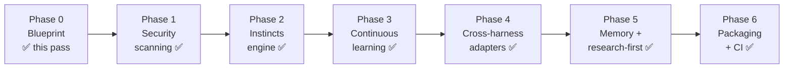

# Roadmap

The path from today's Topology (gates + Claude Code) to the full operator system. Each phase is a
separately-approved unit of work with its own deliverables and a concrete **verify** check — nothing
is "done" without a check that proves it.

> This is the plan, not a changelog. **Phase 0**, **Phase 1 (security scanning)**, the
> **code-review gate** (Phase 1.5), **Phase 2 (instincts engine)**, **Phase 3 (continuous learning)**, and
> **Phase 4 (cross-harness adapters)**, **Phase 5 (memory + research-first)**, and **Phase 6 (packaging & distribution)** are delivered. See
> [`../METHODOLOGY.md`](../METHODOLOGY.md) and [`ARCHITECTURE.md`](ARCHITECTURE.md).

**Why this order.** Security is the biggest true gap, so it's front-loaded (Phase 1). Instincts
(Phase 2) must exist before learning (Phase 3), because learning *promotes* gotchas into instincts —
the target has to be there first. Adapters (Phase 4) come once there's a rich operator set worth
fanning out. Memory/research hardening (Phase 5) and packaging (Phase 6) finish the system.

---

## Phase 0 — Blueprint ✅ (this pass)

**Goal.** A reviewable design any contributor can read, and a path to build it.

**Deliverables.** `METHODOLOGY.md`, `docs/ARCHITECTURE.md`, `docs/ROADMAP.md`, `docs/EXTENDING.md`,
five ADRs under `docs/adr/`, and a surgical `README.md` update. No code.

**Verify.** Every pillar (6) and harness (4) has a named section; Mermaid blocks parse and have ASCII
fallbacks; internal links resolve; Phases 1–6 are framed as *planned*, not done.

---

## Phase 1 — Security scanning ✅ *(front-loaded, delivered 2026-06-06)*

**Goal.** A deterministic safety floor: no secret or dangerous command reaches execution or history.

**Deliverables.**
- `gatekeeper/src/scan.rs` — content/command scanner over `security/rules.toml` (ReDoS-safe `RegexSet`; `serde`/`toml`/`serde_json` per ADR-0007; `json.rs` retired).
- `security/rules.toml` — seed rules (cloud keys, private keys, `rm -rf /`, pipe-to-shell, history rewrite).
- `hooks/security-scan.sh` — `PreToolUse` glue (emits deny/ask JSON; fail-closed).
- `hooks/pre-commit.sh` — pre-commit glue scanning the staged blobs + protected-path integrity.
- `skills/security-scanning/SKILL.md` — when/how the agent invokes and responds to a veto.

**`gatekeeper` surface.** `gatekeeper scan --hook` (PreToolUse JSON on stdin), `--cmd`/`--content`
(stdin), `--staged` (git index), `--check-path 
`; exit `0` clean / `1` veto / `2` fail-closed.

**Verify.** A planted AWS key and a `curl … | sh` are **blocked**; a clean diff/command **passes**;
`cargo test` covers each rule kind; the `PreToolUse` hook blocks a real tool call end to end. Evidence:
`docs/verify/2026-06-06-security-scanning.md`.

**Depends on.** Phase 0.

---

## Phase 2 — Instincts engine ✅ *(delivered 2026-06-08)*

**Goal.** Always-on, reasoning-based guardrails, cheaper than skills, injected every session.

**Deliverables.**
- `instincts/` directory + the `<id>.md` format (frontmatter `id` / `priority` / optional `source`; body = the *why*). Instincts carry **no scope** — always-on.
- `gatekeeper/src/instinct.rs` — hand-rolled frontmatter parser, directory loader (sorted, deduped, fail-mode matrix), preamble renderer with word-budget truncation, `cmd_instinct` (list/render), `activate_section`.
- `activate` extended to inject the always-on instinct set alongside routed skills.
- Six seed instincts: `constraints-as-reasoning`, `evidence-over-assertion`, `gates-not-rules` (high); `surgical-changes-only`, `three-language-lanes` (high), `weakest-enforcement-that-works` (medium).

**New `gatekeeper` surface.** `gatekeeper instinct list`, `gatekeeper instinct render --harness <h> [--budget <n>]`;
`activate` now emits instincts.

**Verify.** `gatekeeper activate` injects the always-on instincts under the `Always-on instincts —`
header for any prompt; a missing `instincts/` dir yields no instincts and exit 0; `gatekeeper instinct
render --harness claude` reproduces the same bodies. Evidence: `docs/verify/2026-06-07-instincts-engine.md`.

**Depends on.** Phase 0. (Independent of Phase 1; orderable either way.)

---

## Phase 3 — Continuous learning ✅ *(delivered 2026-06-08)*

**Goal.** Failures and corrections become permanent operators — the system tightens where it's burned.

**Deliverables.**
- `gatekeeper/src/learn.rs` — capture (append a structured gotcha to the append-only ledger) + promote
  (scaffold an operator; validate it against that operator's own loader; print a diff; write only on
  explicit human confirmation).
- `docs/learn/` — the gotcha ledger (`ledger.md`) + a `README.md` describing the entry format and the loop.
- `skills/capture-gotcha/SKILL.md` — recognize a recurring failure and route it (wired into
  `hooks/skill-rules.json`); `hooks/learn-capture.sh` — an opt-in `Stop` hook for automated capture.
- Promotion path: a ledger entry → a new `instinct`, `skill`, or `security/rules.toml` rule, **human-approved**.

**New `gatekeeper` surface.** `gatekeeper learn capture` (on Stop/gate-failure), `gatekeeper learn list`,
`gatekeeper learn promote`.

**Verify.** `learn capture` appends a parseable `## <id>` entry to `docs/learn/ledger.md` (and a recurrence
is the same id captured again — `learn list` shows the occurrence count); `learn promote --kind instinct`
writes an `instincts/<id>.md` (with `source: ledger:<id>`) that passes `gatekeeper instinct list`,
`--kind skill` writes a `skills/<id>/SKILL.md` that appears in `gatekeeper list`, and `--kind rule
--pattern <re>` appends a `[[rule]]` that `gatekeeper scan` loads; a declined promotion (no `y`) writes
nothing. Evidence: `docs/verify/2026-06-08-continuous-learning.md`.

**Depends on.** Phase 2 (promotes into instincts) and Phase 1 (promotes into scan rules).

---

## Phase 4 — Cross-harness adapters ✅ *(delivered 2026-06-08, ahead of Phase 3)*

**Goal.** Native Codex, Cursor, and OpenCode support generated from the one Markdown source.

**Deliverables.**
- `gatekeeper/src/adapt.rs` — pure `root -> Vec<GenFile>` builders + `apply_or_check` (a `--check`
  idempotency mode); `adapters/README.md` documents the per-harness mapping. No new crates.
- Codex: generate `.codex/config.toml` (project-safe `project_doc_max_bytes`, validated against
  `codex --strict-config`); the contract rides on the auto-discovered `AGENTS.md`. (Project-local config
  may not carry `profiles`/provider keys, so there are no "Codex agents/profiles" — see ADR-0008.)
- Cursor: generate `.cursor/rules/*.mdc` — always-on **instincts** and the `AGENTS.md` contract map to
  Cursor's **Always** mode; keyword-routed **skills** map to **Agent Requested** (description-based — the
  closest primitive, since Cursor has no keyword router; see ADR-0008).
- OpenCode: generate `opencode.json` (`instructions`) + `.opencode/instincts.md` + `.opencode/skills/`
  copied from `skills/`.
- Claude: generate `.claude/settings.json` (the hook wiring) — the source-native harness as a uniform
  generated target. `scripts/install.sh` documents the opt-in `adapt` commands.

**New `gatekeeper` surface.** `gatekeeper adapt --harness {codex|cursor|opencode|claude} [--check]`.

**Verify.** `gatekeeper adapt --harness <h>` writes each harness's native files; the generated
`.codex/config.toml` loads under `codex --strict-config`; `opencode.json` / `.claude/settings.json` are
valid JSON in the documented schema; copied skills are byte-equal; `--check` is idempotent (exit 0) and
flags drift (exit 1). Evidence: `docs/verify/2026-06-08-cross-harness-adapters.md`.

**Depends on.** Phase 2 (instincts to fan out) + the skill set. Phase 3's learning loop is **not** a
prerequisite — it only adds more operators to fan out later, so Phase 4 shipped first.

---

## Phase 5 — Memory + research-first hardening ✅ *(delivered 2026-06-08)*

**Goal.** Make context a managed budget and exploration a gated stage.

**Deliverables.**
- `memory/` protocol — handoff artifact format (one kind; the `compaction` kind was cut — a handoff written before context fills serves the same purpose); `gatekeeper memory write/read/list` helpers, with secret-refusal on the rendered artifact and `memory/artifacts/` write-protection.
- RTK integration documented and wired as the default shell proxy.
- `research` gate: `gatekeeper check research` + `skills/research-first/SKILL.md`, prepended to the sequence.
- The `resume` session-lifecycle skill (read handoff → verify state → act). *(Domain skills for the house stack are deferred — not part of the executed plan. The `code-review` critic skill + `review` gate were pulled forward and delivered 2026-06-05 — see `docs/adr/0006-code-review-gate.md`.)*

**New `gatekeeper` surface.** `gatekeeper check research --feature <slug>`; memory read/write helpers.

**Verify.** The `research` gate blocks `design` when no research note exists; a handoff artifact
round-trips (write → fresh session → resume); the `code-review` subagent returns findings against the plan.
**Evidence:** [`docs/verify/2026-06-08-memory-research-first.md`](verify/2026-06-08-memory-research-first.md) — all 11 acceptance criteria checked, quality gates green (198 passed / 2 ignored, no dependency change).

**Depends on.** Phase 4 (research-first skill should ship to all harnesses).

---

## Phase 6 — Packaging & distribution ✅ *(delivered 2026-06-09)*

**Goal.** One-command install per harness, pinned and CI-guarded.

**Deliverables.**
- Per-harness installer flows + plugin manifests (`.claude-plugin/`, equivalents).
- Version pinning (gatekeeper + rules schema versions).
- CI: `cargo test` / `cargo fmt --check` / `cargo clippy -- -D warnings` + a docs link/coverage lint.

**New `gatekeeper` surface.** `gatekeeper --version`; a `gatekeeper doctor` health check (optional).

**Verify.** A clean-machine install works for each harness; CI is green on a fresh clone; a tagged
release ships a single std-only macOS-arm64 binary (it dynamically links `libSystem`).
**Evidence:** [`docs/verify/2026-06-09-packaging-distribution.md`](verify/2026-06-09-packaging-distribution.md) — all 12 acceptance criteria checked, quality gates green (213 passed / 2 ignored, no dependency change), `claude plugin validate .` passed.

**Depends on.** Phases 1–5.

---

## Status at a glance

| Phase | Capability | Status |
|---|---|---|
| 0 | Blueprint (docs + diagrams + roadmap) | ✅ delivered |
| 1 | Security scanning | ✅ delivered |
| 1.5 | Code-review gate (pulled forward) | ✅ delivered |
| 2 | Instincts engine | ✅ delivered |
| 3 | Continuous learning | ✅ delivered |
| 4 | Cross-harness adapters | ✅ delivered |
| 5 | Memory + research-first | ✅ delivered |
| 6 | Packaging & CI | ✅ delivered |
